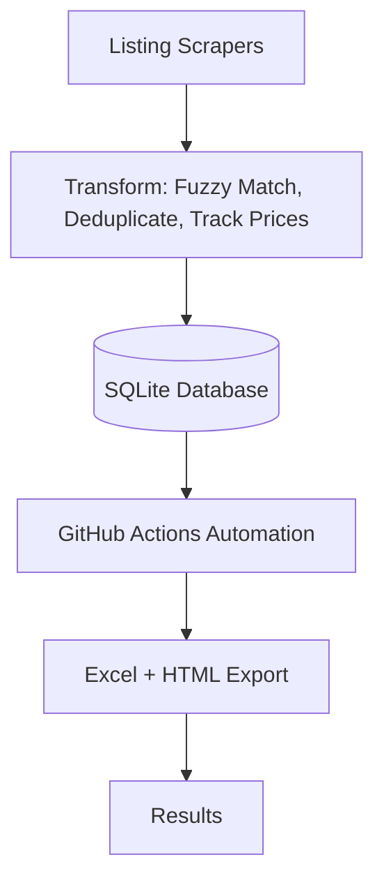

# Motorcycle Listing Tracker

A web scraper that collects motorcycle listings from multiple sites, de-duplicates them, tracks price changes, and displays everything in an Excel spreadsheet and dashboard.
Built with significant AI assistance for code implementation.

## Why I Built This

I was constantly jumping between different listing sites looking for specific motorcycles. I wanted one automated place to see all listings.

## How It Works

1. **Scrape** - Collects listings from Gumtree and WeBuyCars
2. **Process** - Removes duplicates using fuzzy matching
3. **Track** - Records price changes over time  
4. **Display** - Saves to SQLite database and generates Excel exports

ETL workflow for the Motorcycle Listing Tracker:

Runs automatically every Sunday via GitHub Actions.

## What I Learned

### 1. Web Scraping Basics
- Dynamic sites (JavaScript) need Playwright (headless browser)
- Static sites can use regular HTTP requests
- Rate limiting matters (don't hammer servers)

### 2. Handling Data Quality
- Same motorcycle has different names across sites
- Fuzzy matching finds "CB500X" vs "CB 500 X" 
- Had to tune matching thresholds to work right

### 3. Parallel Processing
- Running scrapers one-by-one is slow
- ThreadPoolExecutor runs them at the same time
- Still need delays between requests (be respectful)

### 4. Pipeline Design
- Designed the system so adding new scrapers is easy
- Extract → Transform → Load workflow
- Planning architecture before coding matters

### 5. Database Design
- SQLite provides better data organization than JSON
- Relational schema with price history tracking
- Easy to query and analyze listings

## Implementation Details

- Gumtree & WeBuyCars scrapers (using Playwright)
- Fuzzy duplicate detection
- Price history tracking in SQLite database
- Excel spreadsheet export
- GitHub Pages dashboard
- GitHub Actions automation
- Concurrent scraping with ThreadPoolExecutor

## About This Project

**My role:** Designer, architect, decision-maker, code reviewer

**AI role:** Code implementation (I specified what, AI wrote how)

**My understanding:** I can read through and understand what's happening. I understand why each decision was made. I could modify or extend it.

## Legal & Ethics

This project is for **personal use only**. Please:
- Respect website Terms of Service
- Don't overwhelm servers (use rate limiting)
- Don't use scraped data commercially
- Check `robots.txt` for each website
- Be a good internet citizen

---

https://barnardf.github.io/Motorcycle-listing-web-scraper/
